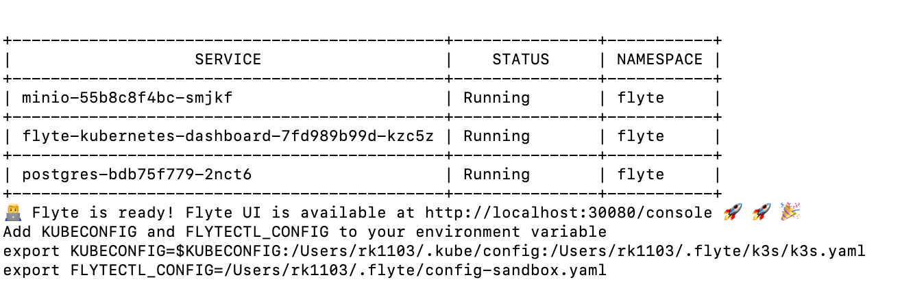
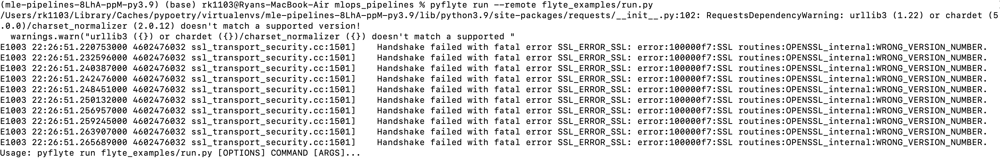
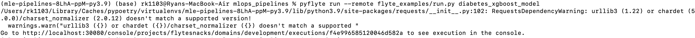

# MLOps pipelines with Flyte

Trying out a range of features for [FlyteKit](https://docs.flyte.org/projects/flytekit/en/latest/index.html)
- Flyte's Python SDK for developing tasks and workflows

## Activate environment and install hooks


Install poetry, dependencies and spawn shell

```shell
pip install poetry
poetry install
poetry shell
```

set up the git hook scripts to run automatically on git commit.

```
$ pre-commit install
```

Run the hooks against all of the files to check working ok

```
$ pre-commit run --all-files
```

## Running workflow locally

```
pyflyte run flyte_examples/run.py diabetes_xgboost_model
```

### Running on Flyte Cluster in remote mode

Follow the [get started guide](https://docs.flyte.org/en/latest/getting_started/index.html) in the
flyte docs for setting up a Demo Flyte Cluster



Then need to export the KUBECONFIG and FLYTECTL_CONFIG environment variables in your shell as below

```
KUBECONFIG=$KUBECONFIG:/Users/rk1103/.kube/config:/Users/rk1103/.flyte/k3s/k3s.yaml
export FLYTECTL_CONFIG=/Users/rk1103/.flyte/config-sandbox.yaml
```

otherwise, you will get the following error




to run with customised dependencies, need to build a Docker image using the Dockerfile and run
the script in container in cluster

```shell
docker build -f Dockerfile -t ryankarlos/flyte-mle:latest .
```

Once the Docker image is built, you can use the image flag and reference the image name with
tag that was built locally

```
pyflyte run --image <registry/repo:version> --remote example.py wf --n 500 --mean 42 --sigma 2
```




or you can  push to dockerhub and then provide the fully qualified image name of your image to the pyflyte run command.
To push to dockerhib, first need to  login to your Dockerhub account from the CLI and  enter the username and
the password for authentication

```
docker login

Login with your Docker ID to push and pull images from Docker Hub. If you don't have a Docker ID, head over to https://hub.docker.com to create one.
Username:
Password:
```

and then push the Docker image to Dockerhub

```shell
docker push <your-dockerhub_name>/flyte-mle
```


If you need multiple tasks run in different containers, then reference the image uri in container
image parameter to the task decorator as described [here](https://docs.flyte.org/projects/cookbook/en/stable/auto/core/containerization/multi_images.html).


